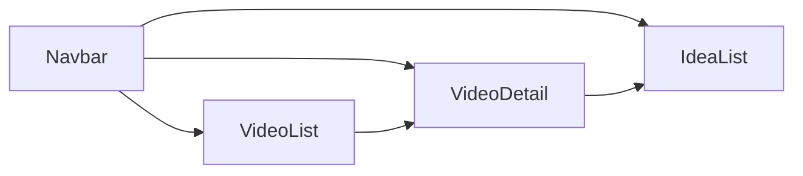

# API Endpoints and Integration Guidelines
The YouTube idea generator project is a Next.js application that provides users with ideas for their YouTube videos. This document outlines the API endpoints and integration guidelines for the project.

## Prerequisites
Basic knowledge of RESTful APIs and JavaScript is required to understand and use the APIs.

## API Endpoints
The project uses the following API endpoints:
- `GET /api/videos`: Retrieves a list of videos.
- `GET /api/videos/:videoId`: Retrieves a specific video by ID.
- `GET /api/ideas`: Retrieves a list of ideas.
- `GET /api/ideas/:ideaId`: Retrieves a specific idea by ID.
- `POST /api/ideas`: Creates a new idea.
- `PUT /api/ideas/:ideaId`: Updates an existing idea.

## Integration Guidelines
To integrate the project with other applications, follow these steps:
1. **Setup**: Clone the repository and install the dependencies using `npm install` or `yarn install`.
2. **API Usage**: Use the API endpoints to retrieve and update data. For example, to retrieve a list of videos, send a `GET` request to `http://localhost:3000/api/videos`.
3. **Error Handling**: Handle errors and exceptions properly. For example, if the API returns an error, catch the error and display a user-friendly error message.

## Code Examples
```javascript
// Retrieve a list of videos
fetch('http://localhost:3000/api/videos')
  .then(response => response.json())
  .then(data => console.log(data))
  .catch(error => console.error(error));

// Create a new idea
fetch('http://localhost:3000/api/ideas', {
  method: 'POST',
  headers: { 'Content-Type': 'application/json' },
  body: JSON.stringify({ idea: 'New idea' }),
})
  .then(response => response.json())
  .then(data => console.log(data))
  .catch(error => console.error(error));
```

## Component Relationships
The project uses the following components:
- `Navbar`: A navigation bar component.
- `VideoDetail`: A video detail component.
- `IdeaList`: A list of ideas component.
- `VideoList`: A list of videos component.
The relationships between the components are shown in the following mermaid diagram:


## Setup Instructions
To set up the project, follow these steps:
1. Clone the repository using `git clone https://github.com/user/repo.git`.
2. Install the dependencies using `npm install` or `yarn install`.
3. Start the development server using `npm run dev` or `yarn dev`.
4. Open the application in a web browser using `http://localhost:3000`.

By following these guidelines and using the provided API endpoints, you can integrate the YouTube idea generator project with other applications and create a seamless user experience.