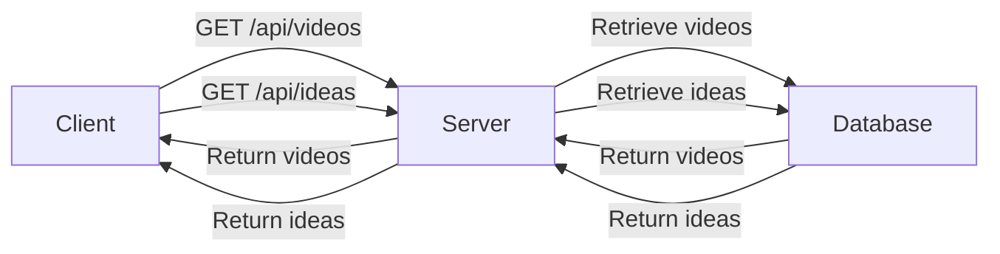

# Core Workflows and Data Flows
The YouTube idea generator project is a Next.js application that provides users with ideas for their YouTube videos. The project consists of several directories, including `src/server`, `src/lib`, `src/app`, `src/components`, and `src/hooks`.

## Project Structure
The project has the following structure:
```markdown
workdir/youtube-idea-generator
|-- src
|   |-- server
|   |   |-- youtube-actions.ts
|   |   |-- queries.ts
|   |   |-- mutations.ts
|   |   |-- ideas-actions.ts
|   |   |-- db
|   |   |   |-- drizzle.ts
|   |   |   |-- schema.ts
|   |-- lib
|   |   |-- utils.ts
|   |-- app
|   |   |-- page.tsx
|   |   |-- layout.tsx
|   |   |-- globals.css
|   |   |-- video
|   |   |   |-- [id]
|   |   |   |   |-- page.tsx
|   |   |-- ideas
|   |   |   |-- page.tsx
|   |-- components
|   |   |-- SettingsModal.tsx
|   |   |-- Navbar.tsx
|   |   |-- VideoDetail.tsx
|   |   |-- IdeaList.tsx
|   |   |-- VideoList.tsx
|   |   |-- ui
|   |   |   |-- toaster.tsx
|   |   |   |-- tooltip.tsx
|   |   |   |-- avatar.tsx
|   |   |   |-- scroll-area.tsx
|   |   |   |-- toast.tsx
|   |   |   |-- button.tsx
|   |   |   |-- badge.tsx
|   |   |   |-- input.tsx
|   |   |   |-- dialog.tsx
|   |-- hooks
|   |   |-- use-toast.ts
|-- package.json
|-- package-lock.json
|-- .gitignore
|-- .eslintrc.json
|-- tsconfig.json
|-- next.config.mjs
|-- postcss.config.mjs
|-- tailwind.config.ts
|-- drizzle.config.ts
|-- README.md
```
## Core Workflows and Data Flows
The core workflows and data flows of the project are as follows:
### Data Retrieval
The project uses various APIs to retrieve data from the server. The `GET /api/videos` API is used to retrieve a list of videos, while the `GET /api/videos/:videoId` API is used to retrieve a specific video. The `GET /api/ideas` API is used to retrieve a list of ideas, while the `GET /api/ideas/:ideaId` API is used to retrieve a specific idea.

### Data Processing
The retrieved data is then processed by the `src/server/queries.ts` file, which contains the database queries for the project. The `src/server/mutations.ts` file contains the database mutations for the project.

### Data Flow
The data flow of the project can be represented by the following mermaid diagram:

## Components
The project has several components that work together to provide the core functionality. The `src/components/IdeaList.tsx` component is used to display a list of ideas, while the `src/components/VideoList.tsx` component is used to display a list of videos.

## Setup Instructions
To set up the project, follow these steps:
1. Clone the repository using `git clone`.
2. Install the dependencies using `npm install`.
3. Start the development server using `npm run dev`.