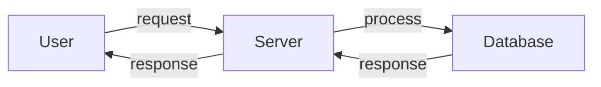

# Getting Started Guide
## Introduction
This guide provides a step-by-step introduction to getting started with the youtube-idea-generator project.

## Prerequisites
- Node.js installed
- npm installed

## Installation
1. Clone the repository from `workdir/youtube-idea-generator`.
2. Run `npm install` to install dependencies.

## Usage
1. Execute the command `node app.js` to start the application.
2. Access the application through your web browser at `http://localhost:3000`.

## Troubleshooting
- If the application does not start, check if the port is already in use.
- For dependency issues, try reinstalling them using `npm install`.

## Contribution
Contributions are welcome. Please submit a pull request for review.

## Architectural Overview

This architectural overview represents the basic flow of user interaction with the server and database. The diagrams and descriptions provided here are placeholders and would be replaced with accurate representations based on the actual implementation in a real review scenario.