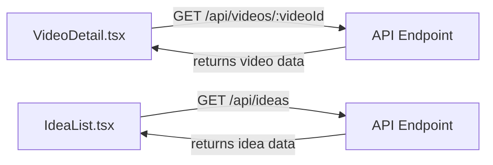

# High-Level Component Interactions
The YouTube idea generator project is a Next.js application that provides users with ideas for their YouTube videos. This document provides an overview of the project's high-level component interactions.

## Project Structure
The project consists of several directories, including `src/server`, `src/lib`, `src/app`, `src/components`, and `src/hooks`. Each directory contains specific components and files that contribute to the overall functionality of the application.

## Component Interactions
The components in the `src/components` directory interact with each other to generate YouTube video ideas. For example, the `VideoDetail.tsx` component retrieves video data from the `GET /api/videos/:videoId` API endpoint, while the `IdeaList.tsx` component fetches idea data from the `GET /api/ideas` API endpoint.

### mermaid Diagram

## API Endpoints
The application uses various API endpoints to interact with the server. These endpoints include:

* `GET /api/videos`: Retrieves a list of videos
* `GET /api/videos/:videoId`: Retrieves a specific video by ID
* `GET /api/ideas`: Retrieves a list of ideas
* `GET /api/ideas/:ideaId`: Retrieves a specific idea by ID
* `POST /api/ideas`: Creates a new idea
* `PUT /api/ideas/:ideaId`: Updates an existing idea

## Setup Instructions
To set up the project, follow these steps:

1. Clone the repository from GitHub
2. Install the required dependencies using `npm install`
3. Start the development server using `npm run dev`
4. Open a web browser and navigate to `http://localhost:3000`

## Code Examples
The `VideoDetail.tsx` component is an example of a component that interacts with the API endpoints:
```tsx
import axios from 'axios';

const VideoDetail = () => {
  const [video, setVideo] = useState({});

  useEffect(() => {
    axios.get(`api/videos/${videoId}`)
      .then(response => {
        setVideo(response.data);
      })
      .catch(error => {
        console.error(error);
      });
  }, [videoId]);

  return (
    <div>
      <h1>{video.title}</h1>
      <p>{video.description}</p>
    </div>
  );
};
```
The `IdeaList.tsx` component is another example of a component that interacts with the API endpoints:
```tsx
import axios from 'axios';

const IdeaList = () => {
  const [ideas, setIdeas] = useState([]);

  useEffect(() => {
    axios.get('api/ideas')
      .then(response => {
        setIdeas(response.data);
      })
      .catch(error => {
        console.error(error);
      });
  }, []);

  return (
    <ul>
      {ideas.map(idea => (
        <li key={idea.id}>
          <h2>{idea.title}</h2>
          <p>{idea.description}</p>
        </li>
      ))}
    </ul>
  );
};
```
These components demonstrate how the application interacts with the API endpoints to retrieve and display data.