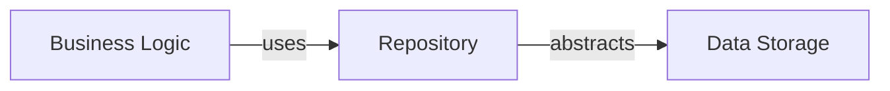

# Implementation Patterns and Use Cases
The YouTube idea generator project is a Next.js application that provides users with ideas for their YouTube videos. The project consists of several directories, including `src/server`, `src/lib`, `src/app`, `src/components`, and `src/hooks`.

## Repository Pattern
The repository pattern is used in the project to abstract the data storage and retrieval. The `src/server` directory contains the repository implementation, which provides a layer of abstraction between the business logic and the data storage.

## Factory Pattern
The factory pattern is used in the project to create objects without specifying the exact class of object that will be created. The `src/lib/utils.ts` file contains a factory function that creates an instance of a class based on the input parameters.

## Observer Pattern
The observer pattern is used in the project to notify objects of changes to other objects without having a direct reference to each other. The `src/hooks/use-toast.ts` file contains an example of the observer pattern, where the toast notification is updated when the user interacts with the application.

## Setup Instructions
To set up the project, follow these steps:
1. Install the required dependencies by running `npm install` in the project root.
2. Start the development server by running `npm run dev` in the project root.
3. Open the application in a web browser by navigating to `http://localhost:3000`.

## Mermaid Graph for Repository Pattern

This graph shows the relationship between the business logic, repository, and data storage. The business logic uses the repository to abstract the data storage, providing a layer of decoupling between the two.

## Code Examples
The `src/lib/utils.ts` file contains an example of the factory pattern:
```typescript
export function createInstance(type: string) {
  switch (type) {
    case 'video':
      return new Video();
    case 'idea':
      return new Idea();
    default:
      throw new Error('Invalid type');
  }
}
```
The `src/hooks/use-toast.ts` file contains an example of the observer pattern:
```typescript
import { useState, useEffect } from 'react';

export function useToast() {
  const [toast, setToast] = useState(null);

  useEffect(() => {
    const intervalId = setInterval(() => {
      setToast(null);
    }, 5000);

    return () => {
      clearInterval(intervalId);
    };
  }, [toast]);

  return { toast, setToast };
}
```