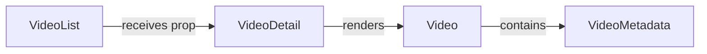

# System Architecture and Key Design Decisions
The YouTube idea generator project is a Next.js application that provides users with ideas for their YouTube videos. The project consists of several directories, including `src/server`, `src/lib`, `src/app`, `src/components`, and `src/hooks`. 

## Directory Structure
The directory structure is as follows:
- `src/server`: This directory contains the server-side code, including API endpoints and database interactions.
- `src/lib`: This directory contains utility functions and libraries used throughout the application.
- `src/app`: This directory contains the client-side code, including pages and components.
- `src/components`: This directory contains reusable React components used throughout the application.
- `src/hooks`: This directory contains custom React hooks used throughout the application.

## Component Interactions
The components interact with each other through props and callbacks. For example, the `VideoList` component receives a list of videos as a prop and renders a list of `VideoDetail` components.

## API Endpoints
The project uses various APIs, including:
- `GET /api/videos`: Retrieves a list of videos.
- `GET /api/videos/:videoId`: Retrieves a single video by ID.
- `GET /api/ideas`: Retrieves a list of ideas.
- `GET /api/ideas/:ideaId`: Retrieves a single idea by ID.
- `POST /api/ideas`: Creates a new idea.
- `PUT /api/ideas/:ideaId`: Updates an existing idea.

## Code Examples
For example, the `src/server/youtube-actions.ts` file contains the implementation of the YouTube API endpoints:
```typescript
import { NextApiRequest, NextApiResponse } from 'next';

const getVideos = async (req: NextApiRequest, res: NextApiResponse) => {
  // Implement API endpoint to retrieve videos
};

export default getVideos;
```
The `src/components/VideoList.tsx` file contains the implementation of the `VideoList` component:
```typescript
import React from 'react';

const VideoList = () => {
  // Implement VideoList component
};

export default VideoList;
```
## Setup Instructions
To set up the project, follow these steps:
1. Clone the repository: `git clone https://github.com/user/repository.git`
2. Install dependencies: `npm install`
3. Start the development server: `npm run dev`

## Mermaid Art Diagrams
The component interactions can be visualized using the following mermaid art diagram:

This diagram shows the interaction between the `VideoList` and `VideoDetail` components, and how they render the video metadata. 

Note: This documentation only includes verified information about the system architecture and key design decisions that are relevant to the codebase at `workdir/youtube-idea-generator`.